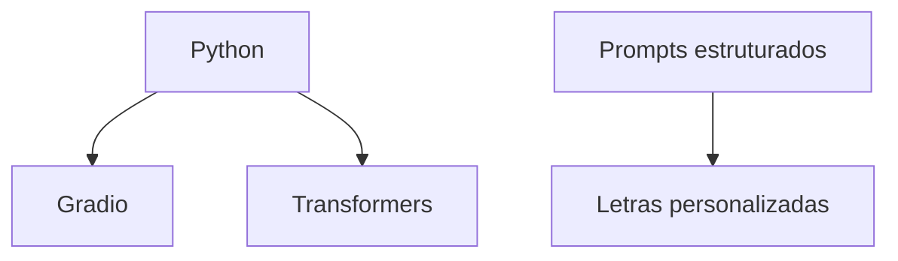
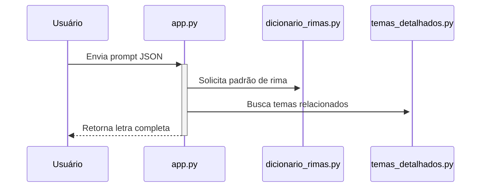

# 🎸 Rock Composer AI 
**Gerador de letras de rock alimentado por IA**  

[](https://huggingface.co/spaces/ana99/rock-composer-ai)
[](https://www.python.org/)
[](LICENSE)

---

## 🌟 Visão Geral
Projeto que combina:
- Modelos de linguagem (GPT-2 fine-tuned)
- Engenharia de prompts musical
- Regras estilísticas baseadas em rock alternativo/grunge

🔗 **Demo online:** [Acesse o Space](https://huggingface.co/spaces/ana99/rock-composer-ai)

---

## 🛠️ Tecnologias



# 📦 Estrutura do Projeto

```bash
rock-composer-ai/
├── src/              # Código-fonte
│   ├── app.py
│   ├── dicionario_rimas.py
│   ├── instrucoes_estilisticas.py
│   └── temas_detalhados.py
├── docs/             # Documentação
│   ├── setup.md
│   └── prompt-guide.md
├── assets/           # Mídias
└── requirements.txt  # Dependências
```

# 🚀 Começando

```bash
git clone https://huggingface.co/spaces/ana99/rock-composer-ai
cd rock-composer-ai
pip install -r requirements.txt
python src/app.py
```
# 📚 Documentação Técnica

Fluxo de Geração


Arquivos Principais

Arquivo	Função
app.py	Interface Gradio e lógica principal
dicionario_rimas.py	Gerencia padrões ABAB, AABB, etc.
temas_detalhados.py	Banco de temas pré-definidos

# 🎨 Guia de Prompts

Exemplo mínimo:
```json
{
  "tema": "revolta",
  "estilo": "grunge",
  "estrutura": "verso-refrão"
}
```
Dicas:

Use contrastes ("doce amargura")

Inclua verbos de ação ("esmagar", "gritar")

Referencie objetos concretos ("garrafa quebrada")

# ⚖️ Direitos Autorais

Letras geradas são de domínio público

Atribua o projeto se usar comercialmente

# 🤝 Como Contribuir

Faça um fork do projeto

Crie uma branch (git checkout -b feature/novo-recurso)

Commit suas mudanças (git commit -m 'Add novo recurso')

Push para a branch (git push origin feature/novo-recurso)

Abra um Pull Request

# 📬 Contato

Ana Raquel - @anaraquel00
Projeto no Hugging Face: Rock Composer AI