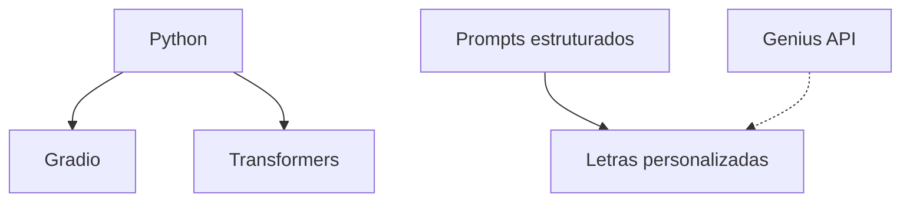
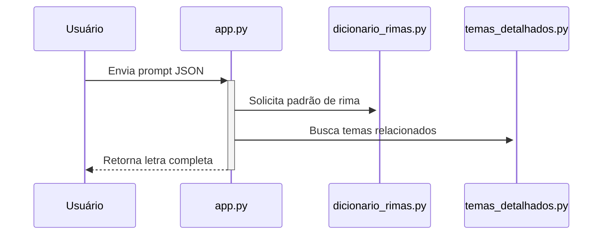

# 🎸 Rock Composer AI 
**Gerador de letras de rock alimentado por IA**  

[](https://huggingface.co/spaces/ana99/rock-composer-ai)
[](https://www.python.org/)
[](LICENSE)

---

## 🌟 Visão Geral
Projeto que combina:
- Modelos de linguagem (GPT-2 fine-tuned)
- Engenharia de prompts musical
- Regras estilísticas baseadas em rock alternativo/grunge
- Geração automática de letras e acordes
- Busca de letras reais via Genius API (opcional)
- Estruturas dinâmicas de música e instruções estilísticas por subgênero

🔗 **Demo online:** [Acesse o Space](https://huggingface.co/spaces/ana99/rock-composer-ai)

---

## 🛠️ Tecnologias


# 📦 Estrutura do Projeto

```bash
rock-composer-ai/
├── app.py
├── dicionario_rimas.py
├── instrucoes_estilisticas.py
├── temas_detalhados.py
├── requirements.txt
├── README.md
├── docs/
│   ├── setup.md
│   └── prompt-guide.md
├── assets/
```

# 🚀 Começando

```bash
git clone https://huggingface.co/spaces/ana99/rock-composer-ai
cd rock-composer-ai
pip install -r requirements.txt
python app.py
```

## 🔑 Genius API (opcional)

Se quiser buscar letras reais de bandas, obtenha uma chave em [https://genius.com/api-clients](https://genius.com/api-clients)  
Defina a variável de ambiente antes de rodar o app:

```bash
export GENIUS_API_KEY="sua_chave_aqui"
python app.py
```

# 📚 Documentação Técnica

Fluxo de Geração



### Arquivos Principais
| Arquivo               | Função                              |
|-----------------------|-------------------------------------|
| `app.py`              | Interface Gradio e lógica principal |
| `dicionario_rimas.py` | Gerencia padrões ABAB, AABB, etc.   |
| `temas_detalhados.py` | Banco de temas pré-definidos        |
| `instrucoes_estilisticas.py` | Regras e instruções de estilo |

# 🎨 Guia de Prompts

Exemplo mínimo:
```json
{
  "tema": "revolta",
  "estilo": "grunge",
  "estrutura": "verso-refrão"
}
```
Dicas:
- Use contrastes ("doce amargura")
- Inclua verbos de ação ("esmagar", "gritar")
- Referencie objetos concretos ("garrafa quebrada")

# ⚡️ Aprimoramentos Recentes

- **Chave da Genius API agora é lida de variável de ambiente** para maior segurança.
- **Instruções estilísticas** são exibidas de forma clara antes de cada parte da música.
- **Estruturas dinâmicas**: versos, refrões e pontes são montados conforme o subgênero.
- **Frases dos versos mais curtas e variadas**.
- **Código robusto** para lidar com diferentes formatos de instruções estilísticas.
- **Busca de letras reais** só ocorre se a dependência e a chave estiverem presentes.

# ⚖️ Direitos Autorais

- Letras geradas são de domínio público
- Atribua o projeto se usar comercialmente

# 🤝 Como Contribuir

1. Faça um fork do projeto
2. Crie uma branch (`git checkout -b feature/novo-recurso`)
3. Commit suas mudanças (`git commit -m 'Add novo recurso'`)
4. Push para a branch (`git push origin feature/novo-recurso`)
5. Abra um Pull Request

# 📬 Contato

Ana Raquel - [@anaraquel00](https://huggingface.co/ana99)  
Projeto no Hugging Face: [Rock Composer AI](https://huggingface.co/spaces/ana99/rock-composer-ai)